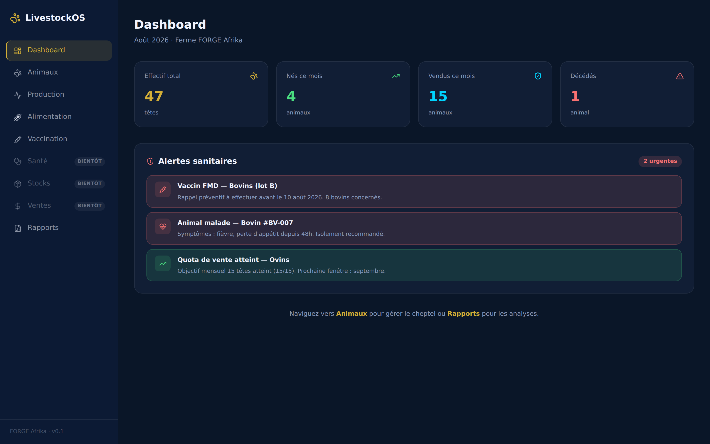
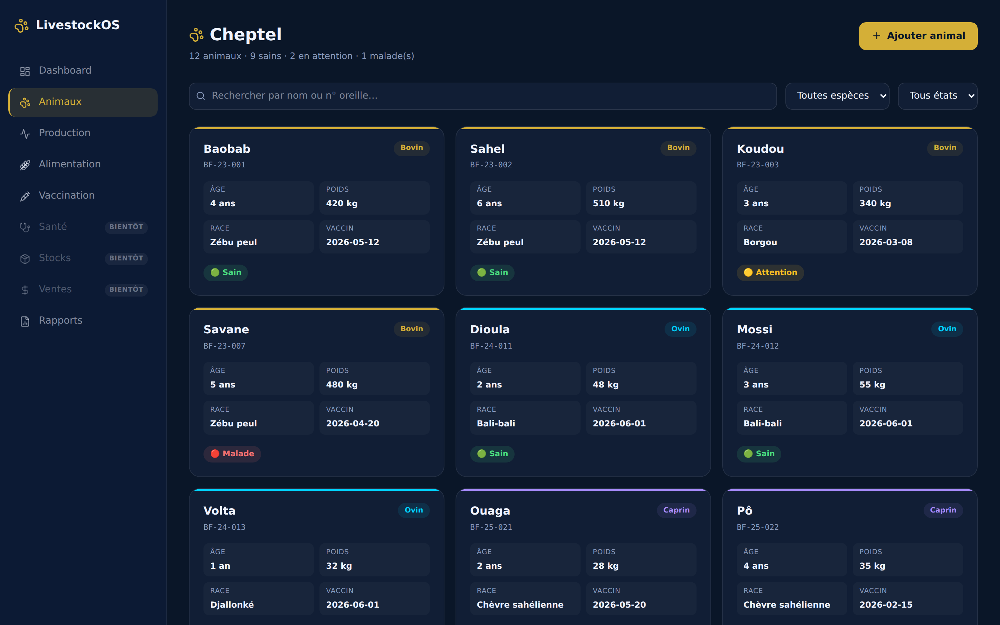
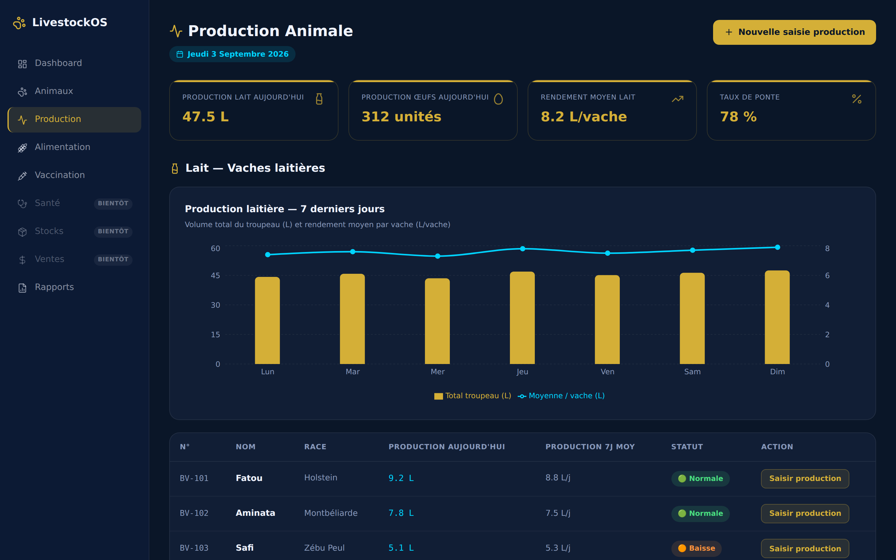
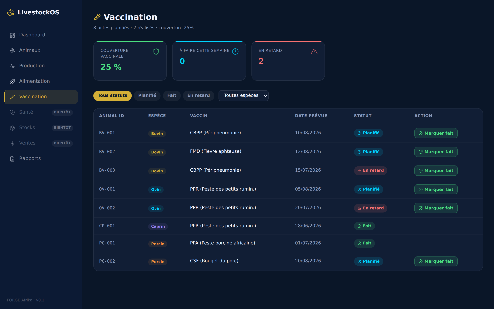
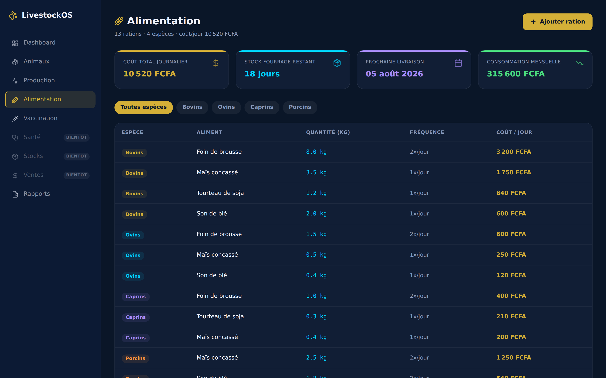
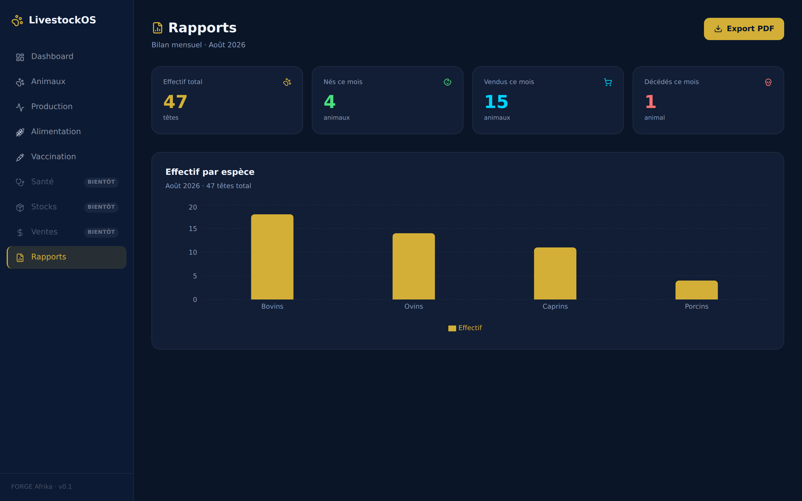

<div align="center">

# 🐄 LivestockOS

*Gestion de cheptel pour les éleveurs d'Afrique de l'Ouest*

[](https://nextjs.org)
[](https://react.dev)
[](https://www.typescriptlang.org)
[](.github/workflows/ci.yml)

</div>

---

## À propos

LivestockOS suit un cheptel au quotidien : effectifs, naissances, ventes, mortalité, production laitière et avicole, rappels de vaccination, rations et coûts d'alimentation.

L'interface est pensée pour un usage en ferme — colonnes courtes, chiffres lisibles à distance, alertes sanitaires remontées en tête de tableau de bord plutôt qu'enfouies dans un sous-menu.

> **État actuel : démonstration.** Les données sont en dur dans les composants ; il n'y a ni base de données ni authentification. Six sections sur neuf sont implémentées — les trois autres sont marquées **BIENTÔT** dans la navigation.

---

## Aperçu

### Tableau de bord

Effectifs du mois et alertes sanitaires triées par priorité.



### Cheptel



### Production

Lait et œufs, avec suivi par animal et détection des baisses de rendement.



### Vaccination



### Alimentation

Rations par espèce et coût journalier consolidé.



### Rapports



---

## Sections

| Section | État |
|---|---|
| Dashboard | ✅ |
| Animaux | ✅ |
| Production | ✅ |
| Alimentation | ✅ |
| Vaccination | ✅ |
| Rapports | ✅ |
| Santé | 🚧 à venir |
| Stocks | 🚧 à venir |
| Ventes | 🚧 à venir |

Les sections à venir apparaissent dans la navigation, grisées et non cliquables. Un test lie cette liste à l'arborescence réelle des pages : ajouter une entrée de menu sans créer la page correspondante fait échouer la CI.

---

## Stack

```
Framework  : Next.js 16 (App Router) + React 19
Langage    : TypeScript 5, mode strict
Styles     : Tailwind CSS v4
Animations : Framer Motion
Graphiques : Recharts
Tests      : Vitest + Testing Library
```

---

## Démarrer

**Prérequis :** Node.js 22+

```bash
git clone https://github.com/dosteeve2-hash/livestockos.git
cd livestockos
npm ci
npm run dev
```

Ouvre [http://localhost:3000](http://localhost:3000). Aucune variable d'environnement n'est nécessaire — l'application tourne sur des données de démonstration.

### Scripts

| Commande | Rôle |
|---|---|
| `npm run dev` | Serveur de développement |
| `npm run build` | Build de production |
| `npm run lint` | ESLint |
| `npm run typecheck` | `tsc --noEmit` |
| `npm test` | Vitest |

La CI exécute les quatre derniers sur chaque pull request.

---

## Captures

Les images de ce README sont générées depuis l'application réelle, pas maquettées :

```bash
npm run build && npx next start -p 3210   # dans un terminal
node scripts/captures.mjs                  # dans un autre
```

---

<div align="center">

**[Steve Donald Compaoré](https://steeve-portfolio-mocha.vercel.app)** · [docompaore2@gmail.com](mailto:docompaore2@gmail.com)

*FORGE Afrika — construire la tech africaine de demain, aujourd'hui.*

</div>
